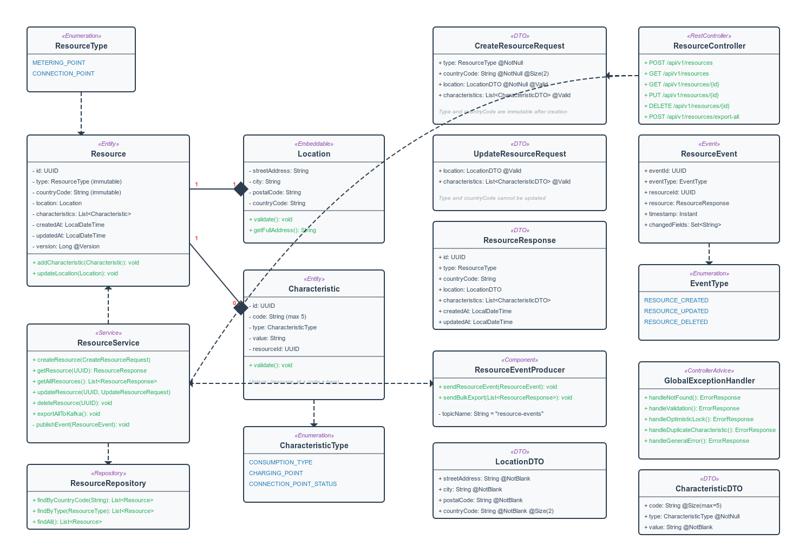

# Resource Management API

Spring Boot REST API for managing energy resources (metering points and connection points) across Estonia and Finland with Kafka event publishing.

## System Overview



This UML diagram shows the application structure with ~95% accuracy - it helps understand the overall architecture and component relationships, though some implementation details may vary.

## Test Coverage

The project includes comprehensive test classes to ensure code quality and functionality:
- **Unit Tests**: `ResourceServiceTest` - Service layer business logic testing
- **Integration Tests**: `AbstractIntegrationTest`, `ResourceControllerIntegrationTest`, `ResourceRepositoryTest` - Full API and database testing
- **Application Tests**: `ResourceManagementApplicationTests` - Spring Boot context loading

## Quick Start

**Prerequisites:** Docker Desktop only

```bash
git clone https://github.com/boyrazcan33/resource-mng  # or <repository-url>
cd resource-mng  # actual repo directory name
docker-compose up --build
```

Access the services:
- **API Documentation**: http://localhost:8082/swagger-ui.html
- **Kafka Events UI**: http://localhost:8091
- **Database**: localhost:5432 (postgres/postgres)

## Quick Test Flow

1. **Build & Start**: `docker-compose up --build` (Takes 1-3 minutes)
2. **Test API**:
    - Go to http://localhost:8082/swagger-ui.html
    - For example, try POST `/api/v1/resources/export-all` → Click "Try it out" → Click "Execute"
    - (This endpoint requires no input data, unlike creating new resources)
3. **Check Events**:
    - Go to http://localhost:8091
    - Click "Topics" → Click "resource-events" → Click "Messages"
    - You can see your Kafka events here

## API Endpoints

| Method | Endpoint | Description |
|--------|----------|-------------|
| POST | `/api/v1/resources` | Create new resource with location and characteristics |
| GET | `/api/v1/resources/{id}` | Retrieve a single resource by ID |
| GET | `/api/v1/resources` | Retrieve all resources (with optional filters) |
| PUT | `/api/v1/resources/{id}` | Update existing resource, location, and characteristics |
| DELETE | `/api/v1/resources/{id}` | Delete resource |
| POST | `/api/v1/resources/export-all` | Export all resources to Kafka |

## Testing the API

Open http://localhost:8082/swagger-ui.html and try any endpoint interactively. Check Kafka events at http://localhost:8091.

## Kafka Events

Every resource operation automatically publishes events to `resource-events` topic:
1. Create/Update/Delete a resource via API
2. Event is published to Kafka
3. View events in Kafka UI: http://localhost:8091

## Technology Stack

- Java 21 + Spring Boot 3.5.5
- PostgreSQL 15
- Apache Kafka
- Flyway (database migrations)
- MapStruct (DTO mapping)
- Docker & Docker Compose
- Swagger/OpenAPI (API documentation)

## Sample Data

- **100,000 resources** (50K Metering Points + 50K Connection Points)
- **~250,000 characteristics** (average 2.5 per resource)
- **Distribution**: 50% Estonia (EE), 50% Finland (FI)
- **Cities**: Tallinn, Tartu, Narva (EE) / Helsinki, Turku, Tampere (FI)
- **Generation time**: ~2 minutes on first startup


## Running Tests

**macOS/Linux (Bash):**
```bash
chmod +x ./mvnw
./mvnw dependency:go-offline -B
./mvnw test
```

**Windows (PowerShell):**
```powershell
./mvnw dependency:go-offline -B
./mvnw test
```

Note: First dependency download may take 5-10 minutes. The `dependency:go-offline` is only needed for first attempt. Make sure you're using the correct terminal (Bash/PowerShell) for your system.

## Stopping the Application

```bash
docker-compose down
```